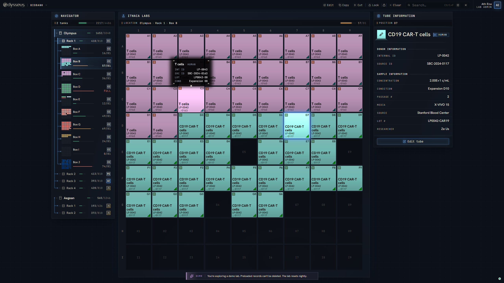
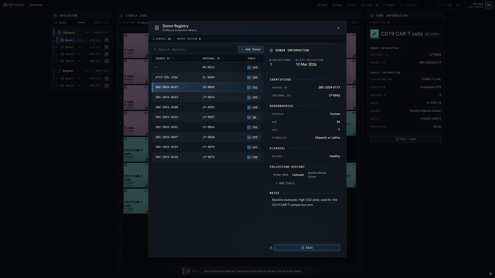
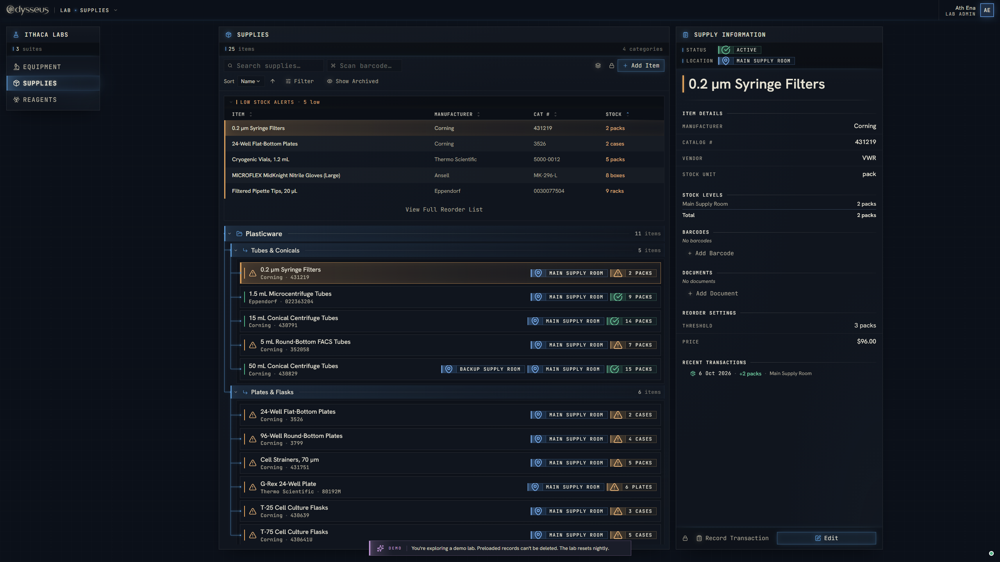
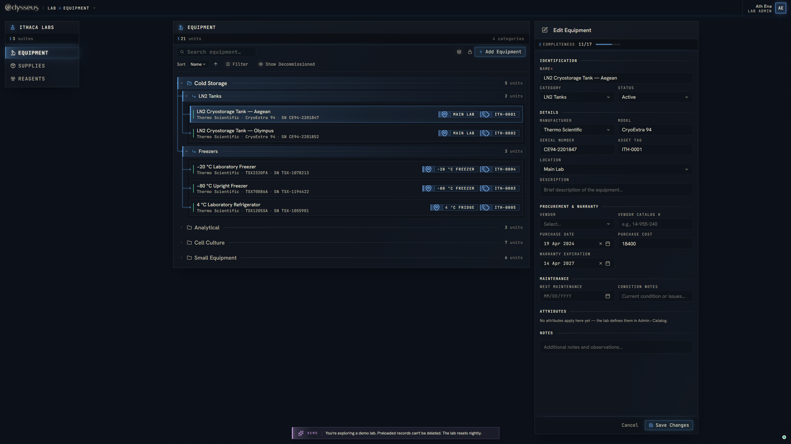

# Odysseus

A lab management platform. Your samples, supplies, reagents and equipment live in one place instead of a folder of
spreadsheets.

Try it at **https://odysse-us.vercel.app** with the demo account. The demo lab resets every night.

It started as a replacement for the Excel sheets our lab used to track its liquid nitrogen inventory, and grew to cover
everything else the lab keeps track of.

## Biobank

- Set up storage to match your lab: tanks, racks and boxes, each box sized to fit. Boxes can belong to one person or
  be shared.
- See every box as a grid of tubes. Add, edit and move tubes one at a time or many at once, with copy and paste.
- Lock tubes so no one else can change them or set them aside for specific projects, and share the lock with the people who need it.
- Keep a donor registry with each donor's demographics and collection history, linked to their tubes.
- Search every tube in the lab and jump straight to it in its box.
- See changes the moment a colleague makes them.

## Lab management

Everything else the lab tracks, with reminders so nothing runs out or gets missed.

- **Supplies:** stock on hand, and a reorder list when something runs low.
- **Reagents:** stock by lot, with a warning before anything expires or runs out.
- **Equipment:** warranties, documents and a maintenance log that reminds you when service is due.
- Barcode scanning and label printing for supplies and reagents to help maintain and organize your stock rooms.

  
  

## Your lab

- Many labs share one Odysseus, and each sees only its own.
- Lab admins set up storage, manage stock and invite people. Everyone else gets on with the work.
- Every change is recorded with who made it and when.

## Coming next

A workbench for designing and building protocols and handing them off for record keeping, open to any scientist, in a
lab or on their own.

## License

Copyright (C) 2025-2026 Evan Massi. Licensed under the [GNU Affero General Public License v3.0](LICENSE).
