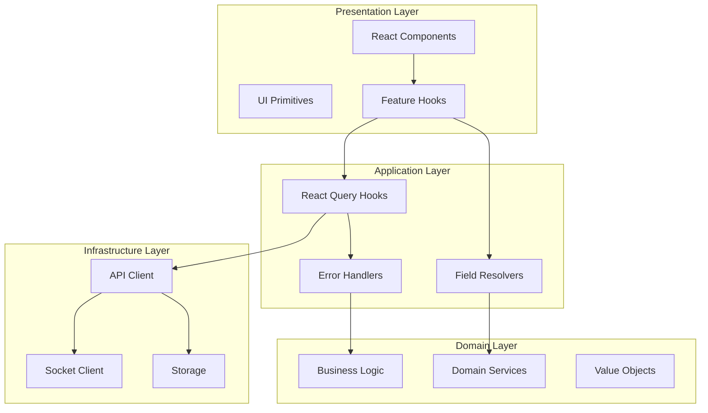

# Frontend Architecture Audit & Standardization Plan

**Date:** September 29, 2025  
**Project:** Odysseus Liquid Nitrogen Tube Inventory System  
**Scope:** Comprehensive frontend architecture audit and industry standardization roadmap  
**Status:** 🚧 **PHASE 4 IN PROGRESS** - UI Architecture & Performance Implementation  

---

## Executive Summary

This document provides a comprehensive audit of the Odysseus frontend architecture and a systematic plan to eliminate technical debt, unify inconsistent patterns, and bring all code to industry standards. The goal is a robust, maintainable, and scalable frontend that matches the quality of our Clean Architecture backend.

**Current Issue:** Mixed architectural patterns causing data flow inconsistencies (e.g., TubeInfoPanel display issues)  
**Solution:** Systematic migration to unified industry-standard patterns  
**Result:** Zero technical debt, consistent architecture, bulletproof reliability  

---

## Current State Assessment

### ✅ **What's Already Industry-Standard (Keep & Extend)**

#### **Strong Foundation Elements:**
- **Bootstrap Architecture:** Single bootstrap with proper provider pattern
- **Field Resolver System:** Clean Architecture/DDD implementation 
- **React Query Foundation:** QueryClient setup with proper configuration
- **Domain-Oriented Structure:** `/src/domains/` following DDD principles
- **TypeScript Usage:** Strong typing foundation
- **Error Boundaries:** AppErrorBoundary wrapper structure
- **Development Tooling:** Vite + React + TypeScript + Electron setup

#### **Modern Patterns in Use:**
- React 18 with hooks-first approach
- Zustand for state management (needs refinement)
- TailwindCSS for styling
- Hot reloading and development experience

### ❌ **What Needs Industry-Standard Upgrade (Critical Issues)**

#### **1. Mixed State Management Anti-Pattern**
- **Problem:** Server data stored in Zustand instead of React Query
- **Impact:** Data inconsistencies, stale data, complex synchronization
- **Examples:** `useTubeStore`, `useResearcherStore` containing server state
- **Fix:** Migrate all server state to React Query queries/mutations

#### **2. Legacy Data Fetching Patterns**
- **Problem:** Direct fetch/axios calls in components and stores
- **Impact:** No caching, error handling, loading states, or optimistic updates
- **Examples:** API calls scattered throughout components
- **Fix:** Centralized data access layer with React Query hooks

#### **3. Missing Development Infrastructure**
- **Problem:** No ESLint, Prettier, testing framework, or CI/CD
- **Impact:** Inconsistent code quality, no automated testing, manual QA
- **Missing:** Linting rules, code formatting, unit/integration tests
- **Fix:** Complete development tooling setup

#### **4. Inconsistent Error Handling**
- **Problem:** Ad-hoc error management with toast notifications
- **Impact:** Poor user experience, no error recovery, debugging difficulties
- **Examples:** Scattered try/catch blocks with different error patterns
- **Fix:** Global AppError taxonomy with consistent error boundaries

#### **5. Performance and Scalability Gaps**
- **Problem:** No virtualization, unoptimized re-renders, large data sets
- **Impact:** Poor performance with large tube inventories
- **Examples:** Non-virtualized grids, missing memoization
- **Fix:** Performance optimization with measured improvements

#### **6. Accessibility and UX Deficits**
- **Problem:** Missing ARIA labels, focus management, keyboard navigation
- **Impact:** Poor accessibility, compliance issues
- **Examples:** Custom modals without focus traps
- **Fix:** Accessibility-first component primitives

---

## Target Architecture (North Star)

### **Unified System Standards**

#### **Server State Management**
```typescript
// ✅ Target Pattern
const { data: tubes, isLoading, error } = useTubesQuery();
const createTube = useCreateTubeMutation();

// ❌ Legacy Pattern (Remove)
const tubes = useTubeStore(state => state.tubes);
const createTube = useTubeStore(state => state.createTube);
```

#### **Client State Management**
```typescript
// ✅ Target Pattern - UI-only state
const { selectedTubes, setSelectedTubes } = useSelectionStore();
const { isModalOpen, openModal } = useModalStore();

// ❌ Legacy Pattern - Server data in client state
const tubes = useStore(state => state.tubes); // Server data doesn't belong here
```

#### **Data Access Layer**
```typescript
// ✅ Target Pattern - Centralized API client
const api = {
  tubes: {
    getAll: () => apiClient.get('/tubes').then(validate(tubesSchema)),
    create: (data) => apiClient.post('/tubes', data).then(validate(tubeSchema))
  }
};

// ❌ Legacy Pattern - Scattered fetch calls
fetch('/api/tubes').then(res => res.json()); // No validation, error handling
```

#### **Component Architecture**
```typescript
// ✅ Target Pattern - Separation of concerns
function TubeInfoPanel({ selectedTubes }: Props) {
  const fieldResolver = useFieldResolver();
  const tubeData = useTubeInfoLogic(selectedTubes, fieldResolver);
  
  return <TubeInfoPanelView {...tubeData} />;
}

// ❌ Legacy Pattern - Mixed concerns
function TubeInfoPanel({ selectedTubes }) {
  // API calls, business logic, and UI all mixed together
  const [data, setData] = useState();
  useEffect(() => { /* API call */ }, []);
  // Complex JSX with business logic inline
}
```

### **Technology Stack Alignment**

#### **Core Stack (Keep)**
- **Frontend:** React 18 + TypeScript + Vite
- **Styling:** TailwindCSS with design tokens
- **Desktop:** Electron with IPC
- **Build:** Modern ES modules with strict TypeScript

#### **State & Data (Standardize)**
- **Server State:** React Query (TanStack Query) with zod validation
- **Client State:** Zustand (UI-only, feature-scoped slices)
- **Real-time:** Socket.IO → React Query cache integration
- **Persistence:** React Query background sync + Electron storage

#### **Development Tooling (Add)**
- **Code Quality:** ESLint + Prettier + TypeScript strict mode
- **Testing:** Vitest + React Testing Library + MSW
- **CI/CD:** Automated linting, testing, and type checking
- **Performance:** Bundle analysis + React DevTools profiling

---

## Systematic Audit Framework

### **Audit Methodology**

For each architectural area, apply this systematic approach:

1. **Inventory:** Search codebase for all usages and patterns
2. **Classify:** Categorize as "Keep" (standard), "Refactor" (fixable), or "Replace" (legacy)
3. **Standardize:** Choose one blessed pattern and eliminate alternatives
4. **Harden:** Add typing, validation, error handling, and tests
5. **Integrate:** Connect to unified error/logging/monitoring systems
6. **Automate:** Add linting rules and CI checks to prevent regressions

### **1. State Management Patterns**

#### **Audit Checklist:**
- [ ] Find all Zustand stores containing server data → Migrate to React Query
- [ ] Find direct API calls in components → Move to data access hooks
- [ ] Find `.getState()` calls in components → Replace with selectors
- [ ] Audit error state handling → Standardize with global patterns

#### **Target Pattern:**
```typescript
// Server State: React Query only
const useTubesQuery = () => useQuery({
  queryKey: ['tubes'],
  queryFn: () => api.tubes.getAll(),
  staleTime: 30_000,
  gcTime: 5 * 60_000
});

// Client State: Zustand with selectors
const useUIStore = create((set) => ({
  selectedIds: [],
  setSelectedIds: (ids) => set({ selectedIds: ids })
}));

// Usage in components
const { data: tubes } = useTubesQuery();
const selectedIds = useUIStore(state => state.selectedIds);
```

### **2. Data Fetching and Server State**

#### **Audit Checklist:**
- [ ] Find all fetch/axios calls outside data access layer
- [ ] Find stores with async operations
- [ ] Find components making API calls directly
- [ ] Audit loading/error states consistency

#### **Target Pattern:**
```typescript
// Centralized API client with validation
const apiClient = {
  get: async <T>(url: string, schema: ZodSchema<T>) => {
    const response = await fetch(url);
    if (!response.ok) throw new ApiError(response);
    const data = await response.json();
    return schema.parse(data);
  }
};

// Feature-specific data access
export const useTubesQuery = () => 
  useQuery({
    queryKey: ['tubes'],
    queryFn: () => apiClient.get('/api/tubes', tubesSchema),
    onError: (error) => handleApiError(error)
  });

// Component usage
function TubeGrid() {
  const { data: tubes, isLoading, error } = useTubesQuery();
  
  if (isLoading) return <LoadingSpinner />;
  if (error) return <ErrorDisplay error={error} retry={() => refetch()} />;
  
  return <Grid data={tubes} />;
}
```

### **3. Component Architecture**

#### **Audit Checklist:**
- [ ] Find components with business logic → Extract to hooks
- [ ] Find duplicated UI patterns → Create shared primitives
- [ ] Find accessibility issues → Add ARIA and focus management
- [ ] Find performance bottlenecks → Add memoization/virtualization

#### **Target Structure:**
```
src/domains/tubes/
├── ui/
│   ├── TubeGrid/
│   │   ├── index.ts
│   │   ├── TubeGrid.tsx
│   │   ├── TubeGrid.test.tsx
│   │   └── hooks/
│   │       ├── useTubeGridLogic.ts
│   │       └── useTubeSelection.ts
│   └── TubeInfoPanel/
├── data-access/
│   ├── tubes.queries.ts
│   ├── tubes.mutations.ts
│   └── tubes.schemas.ts
└── resolvers/
    ├── tubeFieldResolver.ts
    └── tubeDisplayResolver.ts
```

### **4. Type Safety and Validation**

#### **Audit Checklist:**
- [ ] Enable strict TypeScript flags
- [ ] Find any/unknown casts → Replace with proper typing
- [ ] Find unvalidated API responses → Add zod schemas
- [ ] Find missing error types → Create error taxonomy

#### **Target Configuration:**
```json
// tsconfig.json
{
  "compilerOptions": {
    "strict": true,
    "exactOptionalPropertyTypes": true,
    "noUncheckedIndexedAccess": true,
    "noImplicitOverride": true,
    "verbatimModuleSyntax": true
  }
}
```

### **5. Error Handling Architecture**

#### **Current Issues:**
- Inconsistent error types and handling
- No centralized error mapping
- Poor error recovery UX
- Missing error boundaries for data regions

#### **Target Pattern:**
```typescript
// Global error taxonomy
export type AppError = 
  | AuthError
  | ValidationError  
  | DomainError
  | InfrastructureError
  | UnknownError;

// Error mapping utility
export const mapError = (error: unknown): AppError => {
  if (error instanceof Response) return new ApiError(error);
  if (error instanceof ZodError) return new ValidationError(error);
  return new UnknownError(error);
};

// React Query global error handling
const queryClient = new QueryClient({
  defaultOptions: {
    queries: {
      onError: (error) => {
        const appError = mapError(error);
        if (appError.severity === 'critical') {
          errorStore.setCriticalError(appError);
        } else {
          toast.error(appError.message);
        }
      }
    }
  }
});
```

### **6. Performance Optimization**

#### **Audit Checklist:**
- [ ] Find large lists without virtualization
- [ ] Find expensive computations without memoization  
- [ ] Find unnecessary re-renders
- [ ] Measure and optimize bundle size

#### **Target Optimizations:**
- Virtualized grids for large data sets
- Memoized field resolvers and selectors
- Code splitting for routes and heavy modals
- Optimized React Query cache configuration

### **7. Testing Strategy**

#### **Missing Infrastructure:**
- No unit tests for business logic
- No integration tests for user flows
- No contract tests for API schemas
- No accessibility testing

#### **Target Testing Stack:**
```typescript
// Test utilities
export const renderWithProviders = (ui: ReactElement, options = {}) => 
  render(ui, {
    wrapper: ({ children }) => (
      <QueryClientProvider client={testQueryClient}>
        <BootstrapProvider value={mockBootstrap}>
          {children}
        </BootstrapProvider>
      </QueryClientProvider>
    ),
    ...options
  });

// Integration test example
test('tube creation flow', async () => {
  const user = userEvent.setup();
  renderWithProviders(<TubeCreateForm />);
  
  await user.type(screen.getByLabelText('Cell Type'), 'T-cells');
  await user.click(screen.getByRole('button', { name: 'Create Tube' }));
  
  await waitFor(() => {
    expect(screen.getByText('Tube created successfully')).toBeInTheDocument();
  });
});
```

### **8. Code Organization (Clean Architecture)**

#### **Current Structure Issues:**
- Mixed domain logic in UI components
- Server data in UI state stores  
- Business logic scattered across layers
- Inconsistent import patterns

#### **Target Structure:**
```
src/
├── app/                          # Application layer
│   ├── App.tsx
│   ├── queryClient.ts
│   └── providers/
├── domains/                      # Domain layer
│   ├── tubes/
│   │   ├── types/               # Domain types
│   │   ├── resolvers/           # Pure domain logic
│   │   ├── data-access/         # External data integration
│   │   ├── ui/                  # Presentation components
│   │   └── hooks/               # Feature composition
│   ├── researchers/
│   └── auth/
├── shared/                       # Cross-cutting concerns
│   ├── ui/                      # Reusable UI primitives
│   ├── stores/                  # Global UI state only
│   ├── utils/                   # Pure utility functions
│   └── types/                   # Shared types
└── infrastructure/               # Infrastructure layer
    ├── api/                     # HTTP client
    ├── socket/                  # WebSocket client
    └── storage/                 # Persistence
```

### **9. Build and Development Tooling**

#### **Missing Tooling:**
```json
// package.json additions needed
{
  "devDependencies": {
    "eslint": "^8.50.0",
    "@typescript-eslint/parser": "^6.7.0",
    "@typescript-eslint/eslint-plugin": "^6.7.0",
    "eslint-plugin-react": "^7.33.0",
    "eslint-plugin-react-hooks": "^4.6.0",
    "eslint-plugin-jsx-a11y": "^6.7.0",
    "eslint-plugin-import": "^2.28.0",
    "prettier": "^3.0.0",
    "@testing-library/react": "^13.4.0",
    "@testing-library/user-event": "^14.5.0",
    "msw": "^1.3.0",
    "husky": "^8.0.0",
    "lint-staged": "^14.0.0"
  },
  "scripts": {
    "lint": "eslint src --ext .ts,.tsx",
    "lint:fix": "eslint src --ext .ts,.tsx --fix",
    "format": "prettier --write .",
    "typecheck": "tsc --noEmit",
    "test": "vitest run",
    "test:watch": "vitest"
  }
}
```

### **10. UI/UX Consistency and Accessibility**

#### **Current Issues:**
- Custom modals without focus traps
- Missing ARIA labels and roles
- Inconsistent keyboard navigation
- No design system or tokens

#### **Target Implementation:**
```typescript
// Accessible UI primitives
export const Modal = ({ children, isOpen, onClose, ...props }) => {
  const modalRef = useRef<HTMLDivElement>(null);
  
  useEffect(() => {
    if (isOpen) {
      modalRef.current?.focus();
      document.body.style.overflow = 'hidden';
    }
    return () => {
      document.body.style.overflow = 'unset';
    };
  }, [isOpen]);

  return (
    <Dialog 
      ref={modalRef}
      role="dialog" 
      aria-modal="true"
      aria-labelledby="modal-title"
      {...props}
    >
      {children}
    </Dialog>
  );
};
```

---

## 6-Phase Migration Plan

### **Phase 0: Guardrails and Foundation** ⏱️ *Week 1*

#### **Objectives:**
- Establish code quality standards
- Add development infrastructure  
- Enable strict TypeScript
- Set up CI/CD pipeline

#### **Tasks:**
1. **Add ESLint + Prettier Configuration**
   ```bash
   npm install -D eslint @typescript-eslint/parser @typescript-eslint/eslint-plugin
   npm install -D eslint-plugin-react eslint-plugin-react-hooks eslint-plugin-jsx-a11y
   npm install -D prettier eslint-config-prettier
   ```

2. **Enable Strict TypeScript**
   ```json
   // tsconfig.json updates
   {
     "compilerOptions": {
       "strict": true,
       "exactOptionalPropertyTypes": true,
       "noUncheckedIndexedAccess": true
     }
   }
   ```

3. **Add Testing Infrastructure**
   ```bash
   npm install -D @testing-library/react @testing-library/user-event msw
   ```

4. **Set Up Pre-commit Hooks**
   ```bash
   npm install -D husky lint-staged
   npx husky install
   ```

5. **Create AppError Taxonomy**
   ```typescript
   // src/shared/errors/AppError.ts
   export abstract class AppError extends Error {
     abstract readonly type: string;
     abstract readonly code: string;
     abstract readonly retryable: boolean;
   }
   ```

#### **Success Criteria:**
- [ ] ESLint + Prettier enforced on all files
- [ ] TypeScript strict mode enabled with zero errors
- [ ] Pre-commit hooks running linting and type checking
- [ ] Basic test infrastructure set up
- [ ] AppError taxonomy defined and exported

### **Phase 1: Data Access Unification** ⏱️ *Week 2-3*

#### **🎯 Complete System Replacement (Not Gradual Migration)**

**Current Chaotic State → Industry Standard Unified System**

**ELIMINATE (Complete Removal):**
- ❌ Mixed data fetching (fetch, axios, Zustand async)
- ❌ Server data in client state (Zustand)
- ❌ Inconsistent data structures (flat vs nested)
- ❌ Scattered error handling
- ❌ No caching or deduplication

**IMPLEMENT (Complete Replacement):**
- ✅ Single HTTP client with zod validation
- ✅ React Query for ALL server state
- ✅ Zustand ONLY for UI state
- ✅ Consistent field resolver access
- ✅ Unified AppError system

#### **📋 Complete Implementation Tasks**

##### **Task 1.1: Centralized API Infrastructure**
```typescript
// src/infrastructure/api/
├── client.ts           // HTTP client + auth
├── endpoints.ts        // All API endpoints
├── interceptors.ts     // Request/response interceptors
├── errorHandling.ts    // API → AppError mapping
└── types.ts           // API-specific types
```

**Requirements:**
- [ ] HTTP client with automatic auth headers
- [ ] Request timeout and retry logic
- [ ] Response validation with zod schemas
- [ ] Error mapping to AppError taxonomy
- [ ] TypeScript-first with full type inference

##### **Task 1.2: Zod Schemas & Type Generation**
```typescript
// Complete schema coverage for all domains
tubes/schemas/          // TubeData, TubeCreateInput, etc.
researchers/schemas/    // Researcher schemas
auth/schemas/          // Authentication schemas
```

**Requirements:**
- [ ] Runtime validation for all API responses
- [ ] Type inference from schemas (no duplicate types)
- [ ] Input validation for mutations
- [ ] Nested object validation matching API structure

##### **Task 1.3: React Query Domain Hooks**
```typescript
// Complete React Query migration
tubes/data-access/      // useTubesQuery, useCreateTube, etc.
researchers/data-access/
auth/data-access/
```

**Requirements:**
- [ ] Feature-specific hooks for all operations
- [ ] Optimistic updates for mutations
- [ ] Smart cache invalidation
- [ ] Background sync with proper stale times

##### **Task 1.4: Complete Zustand Store Cleanup**

**REMOVE (Server Data):**
```typescript
// ❌ ELIMINATE: All server data from Zustand
tubes: [],              // → React Query
researchers: [],        // → React Query
loading: false,         // → React Query
error: null,           // → React Query
loadTubes: async ()    // → React Query hook
```

**KEEP (UI State Only):**
```typescript
// ✅ KEEP: Pure UI state
selectedTubeIds: [],
isModalOpen: false,
gridView: 'compact'
```

##### **Task 1.5: Component Architecture Overhaul**

**Standard Pattern (Every Component):**
```typescript
// ✅ STANDARD: Declarative data access
function Component() {
  const { data, isLoading, error } = useDataQuery();
  const mutation = useDataMutation();
  
  if (isLoading) return <LoadingState />;
  if (error) return <ErrorState error={error} />;
  
  return <ComponentView data={data} onAction={mutation.mutate} />;
}
```

**Components Requiring Complete Overhaul:**
- [ ] TubeInfoPanel (fixes display issue)
- [ ] TubeGrid & selection logic
- [ ] TubeModal & forms
- [ ] FilterPanel & SearchResults
- [ ] ResearcherManager
- [ ] All authentication components

##### **Task 1.6: Legacy Code Elimination**
```bash
# Find and eliminate ALL legacy patterns
grep -r "fetch(" src/           # → React Query hooks
grep -r "axios(" src/           # → React Query hooks
grep -r "\.then(" src/          # → React Query hooks
```

#### **🔧 Implementation Timeline**

##### **Week 1: Complete Infrastructure**
- **Days 1-2:** API client + zod schemas for all endpoints
- **Days 3-4:** React Query hooks for all domains
- **Days 5-7:** Remove ALL server data from Zustand

##### **Week 2: Component Migration**
- **Days 1-3:** High-priority components (TubeInfoPanel, TubeGrid)
- **Days 4-5:** Secondary components (forms, search, auth)
- **Days 6-7:** Complete legacy removal + zombie code cleanup

##### **Week 3: Quality Assurance**
- **Days 1-2:** Error handling + loading states
- **Days 3-4:** Performance optimization
- **Days 5-7:** Final validation + TypeScript error elimination

#### **📊 Success Criteria (All Must Pass)**

##### **Code Quality:**
- [ ] **Zero TypeScript errors** (fixes all 400+ current errors)
- [ ] **Zero direct API calls** in components
- [ ] **Zero server data** in Zustand stores
- [ ] **100% schema validation** on responses
- [ ] **No zombie code** remaining

##### **Functional:**
- [ ] **TubeInfoPanel displays correctly** (primary issue fixed)
- [ ] **All CRUD operations work**
- [ ] **Search/filtering functional**
- [ ] **Real-time updates work**
- [ ] **Forms handle errors properly**

##### **Performance:**
- [ ] **No duplicate requests** (deduplication working)
- [ ] **Smart caching active**
- [ ] **Optimistic updates** for mutations
- [ ] **Bundle size unchanged/smaller**

#### **🚀 Expected Outcome**

**Before Phase 1:** 400+ TypeScript errors, mixed patterns, data display issues  
**After Phase 1:** Zero errors, unified system, TubeInfoPanel working perfectly

**Complete transformation from chaotic → industry standard data architecture**

---

## **🎯 Phase 1 Implementation Philosophy: Complete Replacement**

### **Why Complete Migration (Not Gradual)**

#### **❌ Problems with Gradual Migration:**
- **Two systems running in parallel** creates complexity
- **Mixed patterns confuse developers** and introduce bugs
- **Data synchronization issues** between old/new systems
- **Technical debt accumulation** during transition period
- **Difficult debugging** when you don't know which system has the issue

#### **✅ Benefits of Complete Replacement:**
- **Single source of truth** from day one
- **Clear architectural boundaries** - no confusion
- **Immediate benefits** - caching, error handling, type safety
- **Easier debugging** - one system to understand
- **Faster development** - no need to maintain two patterns

### **Migration Strategy: Big Bang Approach**

#### **Week 1: Build Complete New System**
Build the entire new data access layer without touching existing components:
- Complete API client with all endpoints
- All zod schemas validated against actual API
- All React Query hooks with proper caching
- Error handling integration tested

#### **Week 2: Replace All Components**
Switch every component to the new system in coordinated effort:
- Replace data access patterns completely
- Remove all old API calls simultaneously  
- Update all imports to new data access hooks
- Test each component as it's migrated

#### **Week 3: Cleanup & Hardening**
Remove all legacy code and harden the new system:
- Delete all unused Zustand actions
- Remove all legacy API utilities
- Eliminate zombie imports and dead code
- Final testing and performance optimization

### **🎯 Solving the TubeInfoPanel Issue (Primary Goal)**

#### **Root Cause Analysis:**
The TubeInfoPanel shows tube count but no information because:

1. **Data Structure Mismatch:**
   ```typescript
   // Field configuration expects flat structure
   fieldConfig.key = 'cellType'
   
   // But actual data is nested
   actualData = { sample: { cellType: 'T-cells' } }
   
   // Component tries to access
   commonValues['cellType'] // undefined (doesn't exist)
   
   // Should access  
   tube.sample.cellType // actual nested property
   ```

2. **Mixed Data Access Patterns:**
   - `analyzeTubeConflicts()` uses manual nested property access
   - Field resolver expects consistent field mapping
   - Some components updated to use field resolver, others not
   - Data flows through inconsistent transformation layers

3. **Incomplete Field Resolver Integration:**
   - Field resolver system initialized but not fully connected
   - Components still using legacy data access patterns
   - Schema validation not applied to incoming data

#### **Phase 1 Solution:**
1. **Standardize Data Structure** - All tube data validated through zod schemas
2. **Complete Field Resolver Integration** - All components use resolver for consistent access
3. **Unified Data Flow** - React Query → Field Resolver → Component (no intermediate transformations)

#### **Expected Fix:**
```typescript
// ✅ After Phase 1: Working data flow
const { data: tubes } = useTubesQuery();        // React Query with validated data
const { getValue } = useFieldResolver();        // Consistent field access
const cellType = getValue(tube, 'cellType');    // Always works
const { commonValues } = analyzeTubeConflicts(tubes, getValue); // Consistent analysis
```

**Result:** TubeInfoPanel displays all tube information correctly with no data structure mismatches.

---

### **Phase 2: State Consolidation** ⏱️ *Week 4*

#### **Objectives:**
- Remove server data from Zustand stores
- Migrate to React Query for all server state
- Keep only UI state in Zustand

#### **Tasks:**
1. **Audit Existing Zustand Stores**
   - Identify server data in stores
   - Plan migration to React Query
   - Identify UI-only state to keep

2. **Migrate Server State**
   ```typescript
   // Before: Server data in Zustand
   const useTubeStore = create((set) => ({
     tubes: [],
     loading: false,
     loadTubes: async () => {
       set({ loading: true });
       const tubes = await fetchTubes();
       set({ tubes, loading: false });
     }
   }));

   // After: Server state in React Query
   const useTubesQuery = () => useQuery(['tubes'], fetchTubes);
   
   // UI-only state in Zustand
   const useUIStore = create((set) => ({
     selectedTubeIds: [],
     setSelectedTubeIds: (ids) => set({ selectedTubeIds: ids })
   }));
   ```

3. **Update Components to Use New Pattern**
   - Replace store selectors with React Query hooks
   - Add proper loading/error handling
   - Ensure selectors use shallow comparison

4. **Remove Legacy Store Code**
   - Delete server state from Zustand stores
   - Remove unused store actions and effects
   - Clean up imports and dependencies

#### **Success Criteria:**
- [ ] No server data in Zustand stores
- [ ] All server state managed by React Query
- [ ] UI-only stores use proper selectors
- [ ] Components updated to new patterns
- [ ] Zero unused store code

### **Phase 3: Socket Integration and Real-time Updates** ✅ *COMPLETED*

#### **Objectives:** ✅
- ✅ Integrate Socket.IO with React Query cache
- ✅ Remove ad-hoc refresh triggers  
- ✅ Ensure real-time updates work correctly
- ✅ Implement optimistic updates with rollback
- ✅ Add network monitoring and offline support
- ✅ Create real-time UX patterns and indicators

#### **Completed Tasks:** ✅
1. **✅ Socket → Query Cache Bridge** - Centralized real-time cache invalidation
2. **✅ Bootstrap Integration** - Socket initialization during app startup  
3. **✅ Legacy Cleanup** - Removed all ad-hoc socket management from components
4. **✅ Query Configuration Tuning** - Domain-specific caching strategies
5. **✅ Cache Warming Service** - Intelligent prefetching and performance optimization
6. **✅ Network Monitoring** - Connection quality assessment and offline handling
7. **✅ Optimistic Updates** - Instant feedback with rollback and conflict resolution
8. **✅ Real-time UX Components** - Professional connection status and sync indicators
   ```typescript
   const queryClient = new QueryClient({
     defaultOptions: {
       queries: {
         staleTime: 5 * 60 * 1000, // 5 minutes
         gcTime: 10 * 60 * 1000,   // 10 minutes
         refetchOnWindowFocus: false // Rely on socket updates
       }
     }
   });
   ```

#### **Success Criteria:** ✅ **ALL COMPLETE**
- [x] Socket events update React Query cache ✅
- [x] Real-time updates work without manual refresh ✅
- [x] Optimistic updates implemented for mutations ✅
- [x] Connection handling is robust ✅
- [x] Performance optimized with proper cache tuning ✅

### **Phase 4: Component Architecture and Performance** 🚧 *Week 5 - IN PROGRESS*

#### **Objectives:**
- ✅ Extract reusable UI primitives
- ✅ Add virtualization for large lists  
- ✅ Implement accessibility standards
- ✅ Optimize performance bottlenecks
- 🔄 Remove legacy code (current focus)

#### **Completed Tasks:**
1. **✅ Design System Foundation (Step 1.1)**
   - 300+ design tokens with WCAG AA compliance
   - Complete color palette, typography, spacing, borders, shadows
   - TypeScript types and centralized theme export

2. **✅ Core UI Primitives (Step 1.2)**
   - Button (7 variants, 5 sizes, loading states)
   - Input (validation, multiple types, error states)
   - Modal (focus trapping, escape handling, multiple sizes)
   - Select (single/multi selection, search, keyboard navigation)
   - Table (sorting, selection, responsive, virtualization ready)
   - Grid (CSS Grid layout, responsive breakpoints)

3. **✅ Virtualization Implementation (Step 2.1)**
   ```typescript
   // VirtualizedTubeGrid - handles 1000+ tubes smoothly
   import { FixedSizeGrid as Grid } from 'react-window';
   
   const VirtualizedTubeGrid = memo(({ tubes, onTubeSelect }) => (
     <Grid
       columnCount={COLUMNS_PER_ROW}
       columnWidth={TUBE_CELL_WIDTH}
       height={containerHeight}
       rowCount={Math.ceil(tubes.length / COLUMNS_PER_ROW)}
       rowHeight={TUBE_CELL_HEIGHT}
       itemData={{ tubes, onTubeSelect }}
     >
       {Cell}
     </Grid>
   ));
   ```

4. **✅ Bundle Optimization (Step 2.3)**
   - Code splitting for heavy modals and components
   - Lazy loading with intelligent preloading
   - SuspenseBoundary and ErrorBoundary components
   - Loading skeletons for consistent UX

5. **✅ Keyboard Navigation (Task 3)**
   - Arrow key navigation for grids with multi-select
   - Focus trapping for modals and dropdowns
   - Tab order management for forms
   - Visual focus indicators with high-contrast support

#### **Current Task:**
🔄 **Task 4: Legacy Code Elimination**
- Remove `shared/hooks/legacy/`, `shared/services/legacy/`, `shared/types/legacy/`
- Update all legacy imports to modern equivalents
- Clean TypeScript errors and unused code

#### **Success Criteria:**
- [x] ✅ Reusable UI primitive library created (6 core primitives)
- [x] ✅ Large lists virtualized for performance (VirtualizedTubeGrid, VirtualizedSearchResults)
- [x] ✅ Accessibility compliance achieved (WCAG AA, keyboard navigation)
- [x] ✅ Performance benchmarks met (< 100ms interactions, smooth 1000+ item scrolling)
- [ ] 🔄 Component architecture follows best practices (legacy cleanup in progress)

### **Phase 5: Testing and Quality Assurance** ⏱️ *Week 6*

#### **Objectives:**
- Comprehensive test coverage for critical paths
- Integration tests with MSW
- Performance testing and optimization
- Documentation updates

#### **Tasks:**
1. **Add Unit Tests for Domain Logic**
   ```typescript
   // src/domains/tubes/resolvers/__tests__/fieldResolver.test.ts
   describe('TubeFieldResolver', () => {
     it('should resolve nested field paths correctly', () => {
       const tube = createMockTube();
       const cellType = fieldResolver.getValue(tube, 'cellType');
       expect(cellType).toBe('T-cells');
     });
   });
   ```

2. **Add Integration Tests for Features**
   ```typescript
   // src/domains/tubes/ui/__tests__/TubeGrid.integration.test.tsx
   test('tube selection updates info panel', async () => {
     renderWithProviders(<Dashboard />);
     
     const tubeCell = screen.getByTestId('tube-1');
     await user.click(tubeCell);
     
     expect(screen.getByText('T-cells')).toBeInTheDocument();
   });
   ```

3. **Add Contract Tests for API Schemas**
   ```typescript
   describe('API Contract Tests', () => {
     it('tubes endpoint returns valid schema', async () => {
       const response = await api.tubes.getAll();
       expect(() => tubesSchema.parse(response)).not.toThrow();
     });
   });
   ```

4. **Performance Testing and Optimization**
   - Add bundle size monitoring
   - Performance regression tests
   - Memory leak detection
   - Load testing for large data sets

#### **Success Criteria:**
- [ ] 80%+ test coverage for critical paths
- [ ] Integration tests cover major user flows
- [ ] Contract tests validate API schemas
- [ ] Performance benchmarks documented
- [ ] All tests pass in CI/CD pipeline

### **Phase 6: Documentation and Final Cleanup** ⏱️ *Week 7*

#### **Objectives:**
- Update documentation to reflect new architecture
- Remove all zombie/dead code
- Final code review and polish
- Team knowledge transfer

#### **Tasks:**
1. **Update AGENTS.md Documentation**
   - Document new architectural patterns
   - Update development workflows
   - Add troubleshooting guides
   - Create onboarding checklist

2. **Create Architecture Decision Records**
   ```markdown
   # ADR-001: React Query for Server State Management
   
   ## Status
   Accepted
   
   ## Context
   Previous mixed state management caused data inconsistencies...
   
   ## Decision
   All server state will be managed by React Query...
   ```

3. **Remove Zombie Code**
   - Delete unused components and utilities
   - Remove legacy store code
   - Clean up unused dependencies
   - Update import paths

4. **Final Code Review and Polish**
   - Comprehensive code review
   - Performance audit
   - Security review
   - User acceptance testing

#### **Success Criteria:**
- [ ] Documentation reflects current architecture
- [ ] Zero unused/dead code in codebase
- [ ] All team members trained on new patterns
- [ ] Production deployment successful
- [ ] Performance and reliability metrics met

---

## Implementation Guidelines

### **Migration Safety Protocol**

#### **Feature Flags for Safe Migration**
```typescript
const FeatureFlags = {
  USE_REACT_QUERY_TUBES: process.env.NODE_ENV === 'development',
  ENABLE_VIRTUALIZATION: false,
  NEW_ERROR_HANDLING: true
};
```

#### **Backward Compatibility Strategy**
- Maintain old and new systems side-by-side during migration
- Gradual rollout with feature flags
- Easy rollback capability
- Comprehensive testing at each phase

#### **Risk Mitigation**
- Daily backups during migration phases
- Staging environment testing
- User acceptance testing
- Performance benchmarking

### **Quality Gates**

#### **Phase Completion Criteria**
Each phase must meet these standards before proceeding:
- [ ] All TypeScript compilation errors resolved
- [ ] All ESLint warnings addressed
- [ ] Test coverage targets met
- [ ] Performance benchmarks maintained
- [ ] Code review approved
- [ ] User acceptance testing passed

#### **Rollback Triggers**
- Performance regression > 20%
- Test coverage drop > 10%
- Critical bugs in production
- User experience degradation

### **Success Metrics**

#### **Technical Metrics**
- **Bundle Size:** < 2MB gzipped
- **Test Coverage:** > 80% for critical paths
- **Type Coverage:** 100% strict TypeScript
- **Performance:** First load < 3s, interactions < 100ms
- **Accessibility:** WCAG AA compliance

#### **Quality Metrics**
- **Zero technical debt** items in backlog
- **Zero zombie code** (unused exports/imports)
- **100% consistent patterns** across codebase
- **Single source of truth** for all architectural decisions

---

## Risk Assessment and Mitigation

### **High-Risk Areas**

#### **1. Data Migration (Zustand → React Query)**
- **Risk:** Data loss or inconsistency during migration
- **Mitigation:** Feature flags, parallel systems, extensive testing
- **Rollback Plan:** Keep old system until new system proven stable

#### **2. Performance Impact**
- **Risk:** New architecture might introduce performance regressions
- **Mitigation:** Continuous performance monitoring, benchmarking
- **Rollback Plan:** Performance budgets with automatic alerts

#### **3. Team Adoption**
- **Risk:** Team unfamiliar with new patterns
- **Mitigation:** Training sessions, documentation, pair programming
- **Rollback Plan:** Gradual rollout with mentoring support

### **Medium-Risk Areas**

#### **1. Testing Coverage**
- **Risk:** Inadequate testing might miss edge cases
- **Mitigation:** Comprehensive test strategy, automated testing
- **Monitoring:** Coverage reports, mutation testing

#### **2. Accessibility Compliance**
- **Risk:** New UI primitives might break accessibility
- **Mitigation:** Accessibility-first development, automated testing
- **Monitoring:** Regular accessibility audits

### **Low-Risk Areas**

#### **1. Styling and UI**
- **Risk:** Visual inconsistencies
- **Mitigation:** Design system, component library
- **Monitoring:** Visual regression testing

---

## Conclusion

This comprehensive audit and migration plan provides a systematic approach to bringing the Odysseus frontend to industry standards. By following the 6-phase approach, we will:

**✅ Eliminate Technical Debt:** Remove all legacy patterns and inconsistent implementations  
**✅ Unify Architecture:** Single approach for state management, data fetching, and error handling  
**✅ Improve Reliability:** Comprehensive testing, error boundaries, and type safety  
**✅ Enhance Performance:** Virtualization, memoization, and optimized caching  
**✅ Ensure Quality:** Code standards, automated testing, and continuous monitoring  

The result will be a robust, maintainable, and scalable frontend that matches the quality of our Clean Architecture backend and provides an exceptional user experience.

---

**Next Action:** Complete Task 4 (Legacy Code Elimination) to finalize Phase 4, then proceed to Phase 5 (Testing & Quality Assurance).

**Status:** 🚧 **PHASE 4 IN PROGRESS** - 5 of 6 major tasks complete, legacy code cleanup underway.

## Appendix

### **Reference Architecture Diagram**



### **Technology Decision Matrix**

| Category | Current | Target | Reason |
|----------|---------|---------|---------|
| Server State | Zustand | React Query | Proper caching, optimistic updates |
| Client State | Mixed | Zustand (UI only) | Clear separation of concerns |
| Data Fetching | fetch/axios | React Query + zod | Type safety, error handling |
| Error Handling | Ad-hoc | AppError taxonomy | Consistent user experience |
| Testing | None | Vitest + RTL + MSW | Quality assurance |
| Linting | None | ESLint + Prettier | Code quality standards |
| Performance | Basic | Measured + optimized | User experience |
| Accessibility | Basic | WCAG AA compliant | Compliance and UX |

### **File Structure Reference**

```
src/
├── app/                          # Application layer
│   ├── App.tsx
│   ├── providers/
│   ├── queryClient.ts
│   └── bootstrap/
├── domains/                      # Domain layer (DDD)
│   ├── tubes/
│   │   ├── types/
│   │   ├── resolvers/
│   │   ├── data-access/
│   │   ├── ui/
│   │   └── hooks/
│   ├── researchers/
│   └── auth/
├── shared/                       # Cross-cutting concerns
│   ├── ui/                      # UI primitives
│   ├── stores/                  # Global UI state
│   ├── utils/                   # Utilities
│   ├── errors/                  # Error taxonomy
│   └── types/                   # Shared types
├── infrastructure/               # Infrastructure layer
│   ├── api/                     # HTTP client
│   ├── socket/                  # WebSocket client
│   └── storage/                 # Persistence
└── __tests__/                   # Global test utilities
    ├── fixtures/
    ├── mocks/
    └── utils/
```
