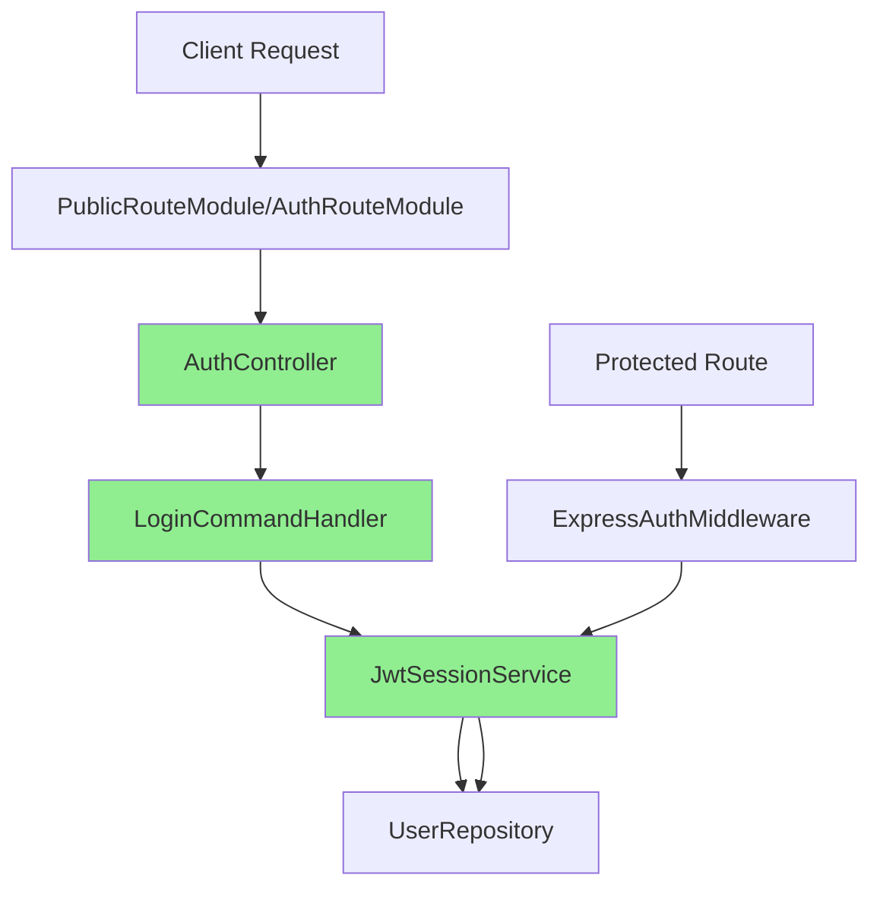
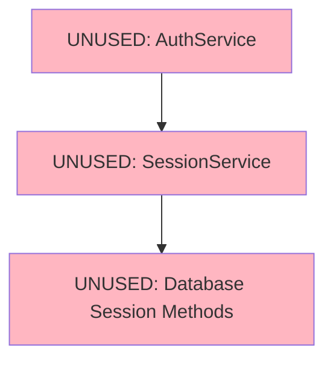

# Odysseus Backend Authentication System Analysis

**Analysis Date:** 2025-01-24  
**Target Directory:** `c:\Users\evan\Desktop\Odysseus\odysseus-app\server\src`

## Executive Summary

The Odysseus application has **TWO DISTINCT AUTHENTICATION SYSTEMS** running in parallel:

1. **🟢 ACTIVE SYSTEM:** JWT-based OAuth 2.0 implementation (Modern CQRS architecture)
2. **🔴 LEGACY SYSTEM:** Session-based authentication with SQLite storage (Deprecated)

**CRITICAL FINDING:** The legacy system is completely unused and safe for removal.

---

## 1. Authentication Routes & Controllers

### Active Routes (Modern System)

**Public Endpoints (No Auth Required):**
- `POST /api/public/auth/login` → [`AuthController.login()`](file:///c:/Users/evan/Desktop/Odysseus/odysseus-app/server/src/presentation/controllers/AuthController.ts#L108)
- `POST /api/public/auth/register` → [`AuthController.register()`](file:///c:/Users/evan/Desktop/Odysseus/odysseus-app/server/src/presentation/controllers/AuthController.ts#L73)
- `POST /api/public/auth/refresh` → [`AuthController.refreshToken()`](file:///c:/Users/evan/Desktop/Odysseus/odysseus-app/server/src/presentation/controllers/AuthController.ts#L135)
- `GET /api/public/auth/first-time` → [`AuthController.checkFirstTime()`](file:///c:/Users/evan/Desktop/Odysseus/odysseus-app/server/src/presentation/controllers/AuthController.ts#L54)

**Authenticated Endpoints (Auth Required):**
- `GET /api/auth/verify` → [`AuthController.verifySession()`](file:///c:/Users/evan/Desktop/Odysseus/odysseus-app/server/src/presentation/controllers/AuthController.ts#L171)
- `GET /api/auth/me` → [`AuthController.getCurrentUser()`](file:///c:/Users/evan/Desktop/Odysseus/odysseus-app/server/src/presentation/controllers/AuthController.ts#L38)
- `POST /api/auth/logout` → [`AuthController.logout()`](file:///c:/Users/evan/Desktop/Odysseus/odysseus-app/server/src/presentation/controllers/AuthController.ts#L42)
- `POST /api/auth/change-password` → [`AuthController.changePassword()`](file:///c:/Users/evan/Desktop/Odysseus/odysseus-app/server/src/presentation/controllers/AuthController.ts#L47)

### Authentication System Used: **JWT-based OAuth 2.0**

All endpoints use the modern **CQRS-based AuthController** with:
- JWT token validation via [`JwtSessionService`](file:///c:/Users/evan/Desktop/Odysseus/odysseus-app/server/src/infrastructure/services/JwtSessionService.ts)
- OAuth 2.0 dual-token architecture (access + refresh tokens)
- Enterprise-grade security patterns

---

## 2. Service Layer Analysis

### 🟢 Active Authentication Flow

**Login Flow (Modern):**
1. [`PublicRouteModule`](file:///c:/Users/evan/Desktop/Odysseus/odysseus-app/server/src/presentation/routes/PublicRouteModule.ts#L48) receives POST to `/api/public/auth/login`
2. [`AuthController.login()`](file:///c:/Users/evan/Desktop/Odysseus/odysseus-app/server/src/presentation/controllers/AuthController.ts#L108) handles request
3. [`LoginCommandHandler.handle()`](file:///c:/Users/evan/Desktop/Odysseus/odysseus-app/server/src/application/commands/UserCommands.ts#L223) validates credentials
4. [`JwtSessionService.createTokenPair()`](file:///c:/Users/evan/Desktop/Odysseus/odysseus-app/server/src/infrastructure/services/JwtSessionService.ts#L190) generates tokens
5. Returns OAuth 2.0 token pair + backward-compatible session token

**Authentication Middleware (Modern):**
1. [`ExpressAuthMiddleware.authenticate`](file:///c:/Users/evan/Desktop/Odysseus/odysseus-app/server/src/infrastructure/security/ExpressAuthMiddleware.ts#L19) extracts Bearer token
2. [`JwtSessionService.validateSession()`](file:///c:/Users/evan/Desktop/Odysseus/odysseus-app/server/src/infrastructure/services/JwtSessionService.ts#L82) validates JWT
3. Supports both OAuth 2.0 (`sub` field) and legacy (`userId` field) token formats
4. Queries database for current user state

### 🔴 Legacy System (Completely Unused)

**Dead Code - Safe for Removal:**
- [`AuthService` class](file:///c:/Users/evan/Desktop/Odysseus/odysseus-app/server/src/services/auth.ts#L28) - Not imported anywhere
- [`SessionService` class](file:///c:/Users/evan/Desktop/Odysseus/odysseus-app/server/src/services/sessionService.ts#L23) - Only used by unused AuthService
- Legacy session methods in database provider interface - Never called

---

## 3. Legacy System Usage Analysis

### Complete Dependency Map

**Legacy createSession() Usage:**
1. [`SessionService.createSession()`](file:///c:/Users/evan/Desktop/Odysseus/odysseus-app/server/src/services/sessionService.ts#L35) - **DEAD CODE**
   - Only called by [`AuthService.login()`](file:///c:/Users/evan/Desktop/Odysseus/odysseus-app/server/src/services/auth.ts#L93)
   - AuthService is never instantiated or imported

2. Database calls from SessionService:
   - [`this.db.createSession()`](file:///c:/Users/evan/Desktop/Odysseus/odysseus-app/server/src/services/sessionService.ts#L44) - **DEAD CODE**
   - [`this.db.getValidSession()`](file:///c:/Users/evan/Desktop/Odysseus/odysseus-app/server/src/services/sessionService.ts#L73) - **DEAD CODE**

**Legacy validateSession() Usage:**
1. [`SessionService.validateSession()`](file:///c:/Users/evan/Desktop/Odysseus/odysseus-app/server/src/services/sessionService.ts#L71) - **DEAD CODE**
   - Only called by unused AuthService methods
   - Never called by active codebase

### Import Analysis - Legacy System

**Files that import legacy components:**
- **NONE** - No active code imports `services/auth.ts` or `SessionService`

**Files that reference legacy interfaces:**
- **NONE** - All active code uses `ISessionService` interface which is implemented by `JwtSessionService`

---

## 4. Database Layer Analysis

### Session Storage

**Active System:** 
- **JWT tokens** - Stateless, no database storage required
- **Refresh tokens** - Placeholder for future database implementation
- User data stored in standard `users` table

**Legacy System (Unused):**
- [`sessions` table](file:///c:/Users/evan/Desktop/Odysseus/odysseus-app/server/src/infrastructure/database/SQLiteContext.ts#L116) defined in schema
- Session management methods exist in interface but **never called**
- Safe for removal after confirming no data exists

### Database Methods Used

**Active Authentication:**
- `getUserByApiKey()` - Used by legacy middleware (planned for removal)
- `findById()` - Used by modern JWT validation
- `findByUsername()` - Used by login flow

**Legacy Methods (Never Called):**
- `createSession()` - Database method never invoked
- `getValidSession()` - Database method never invoked  
- `deleteSession()` - Database method never invoked
- `cleanupExpiredSessions()` - Database method never invoked

---

## 5. Dependencies & Architecture Map

### Current Active Architecture



### Legacy Architecture (Dead Code)



### Service Container Wiring

**Active Services:**
- [`ServiceContainer.getAuthController()`](file:///c:/Users/evan/Desktop/Odysseus/odysseus-app/server/src/infrastructure/di/ServiceContainer.ts#L334) → Returns `AuthController`
- [`ServiceContainer.getSessionService()`](file:///c:/Users/evan/Desktop/Odysseus/odysseus-app/server/src/infrastructure/di/ServiceContainer.ts#L121) → Returns `JwtSessionService`  
- [`ServiceContainer.getAuthMiddleware()`](file:///c:/Users/evan/Desktop/Odysseus/odysseus-app/server/src/infrastructure/di/ServiceContainer.ts#L470) → Returns `ExpressAuthMiddleware`

**Dead Code:**
- No service container methods for legacy `AuthService` or `SessionService`

---

## 6. Token Types & Standards Compliance

### OAuth 2.0 Implementation

**Token Pair Structure:**
```typescript
interface TokenPair {
  accessToken: string;      // JWT (30 min)
  refreshToken: string;     // Secure random (7 days)  
  accessTokenExpiry: Date;
  refreshTokenExpiry: Date;
  tokenType: 'Bearer';
}
```

**JWT Payload (RFC 7519 Compliant):**
- `sub` - Subject (user ID) - **OAuth 2.0 standard**
- `iss` - Issuer
- `aud` - Audience  
- `exp` - Expiration
- `iat` - Issued at
- `jti` - JWT ID

**Backward Compatibility:**
- Legacy tokens with `userId` field still validated
- `sessionToken` field maintained in responses

---

## 7. Safe Removal Recommendations

### ✅ ZERO RISK - Safe to Remove

**Files:**
1. [`services/auth.ts`](file:///c:/Users/evan/Desktop/Odysseus/odysseus-app/server/src/services/auth.ts) - Complete file
2. [`services/sessionService.ts`](file:///c:/Users/evan/Desktop/Odysseus/odysseus-app/server/src/services/sessionService.ts) - Complete file

**Database Methods (from interfaces):**
1. `createSession()` - Never called
2. `getValidSession()` - Never called  
3. `deleteSession()` - Never called
4. `cleanupExpiredSessions()` - Never called
5. `updateSessionActivity()` - Never called
6. `enforceSessionLimit()` - Never called

**Database Schema:**
1. `sessions` table - Check if empty, then drop
2. Session-related indexes - Safe to remove

### 🔍 VERIFICATION STEPS

Before removal, run these checks:

```bash
# 1. Verify no imports of legacy files
grep -r "services/auth" server/src/
grep -r "sessionService" server/src/

# 2. Verify no database session data exists  
sqlite3 server/data/odysseus.sqlite "SELECT COUNT(*) FROM sessions;"

# 3. Test authentication flow
curl -X POST http://localhost:3001/api/public/auth/login \
  -H "Content-Type: application/json" \
  -d '{"username":"admin","password":"password"}'
```

### 📋 REMOVAL CHECKLIST

**Phase 1: Remove Dead Code**
- [ ] Delete `services/auth.ts`
- [ ] Delete `services/sessionService.ts`  
- [ ] Remove session methods from `IDatabaseProvider` interface
- [ ] Remove session methods from database implementations
- [ ] Drop `sessions` table and indexes

**Phase 2: Cleanup References**
- [ ] Remove session-related types/interfaces
- [ ] Remove unused imports
- [ ] Update database migration scripts

**Phase 3: Testing**
- [ ] Run authentication integration tests
- [ ] Verify JWT token validation works
- [ ] Test protected routes
- [ ] Verify refresh token endpoint (when implemented)

---

## 8. Current System Health

### ✅ Production Ready Components

1. **AuthController** - Modern CQRS-based, fully functional
2. **JwtSessionService** - Industry standard JWT implementation  
3. **ExpressAuthMiddleware** - Secure token validation
4. **OAuth 2.0 Token Architecture** - Future-proof, scalable

### 🚧 Incomplete Features

1. **Refresh Token Storage** - Database persistence needed
2. **Token Revocation** - Blacklist implementation pending
3. **Session Analytics** - Usage tracking not implemented

### 🔒 Security Status

- ✅ JWT signing with configurable secrets
- ✅ Token expiration handling
- ✅ Industry standard OAuth 2.0 flows
- ✅ CORS and rate limiting configured
- ⚠️ Refresh token rotation not implemented (recommended)

---

## Conclusion

The authentication system analysis reveals a clean architectural separation:

- **ACTIVE SYSTEM**: Modern JWT-based authentication with CQRS pattern
- **LEGACY SYSTEM**: Completely unused session-based code

**Recommendation**: Proceed with immediate removal of legacy authentication components. The system is running entirely on the modern JWT implementation, making legacy removal a zero-risk operation that will:

1. Reduce codebase complexity
2. Eliminate maintenance overhead  
3. Remove potential security confusion
4. Clean up database schema

The current JWT-based system is production-ready and follows industry best practices for OAuth 2.0 token management.
